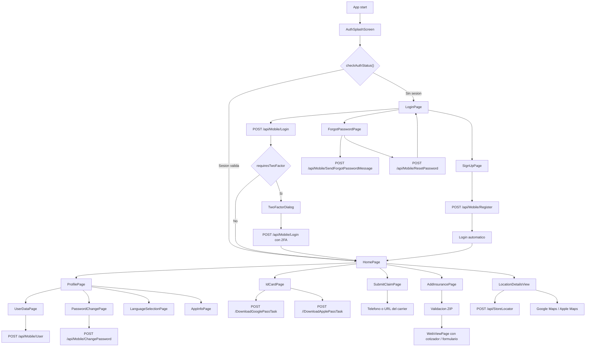
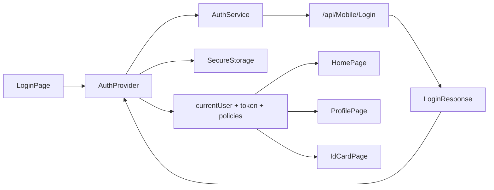
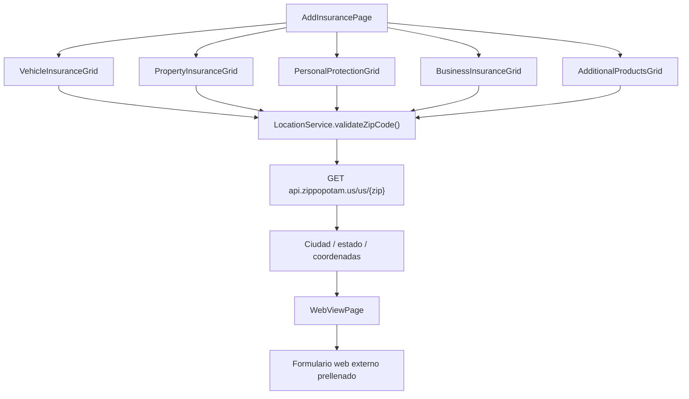
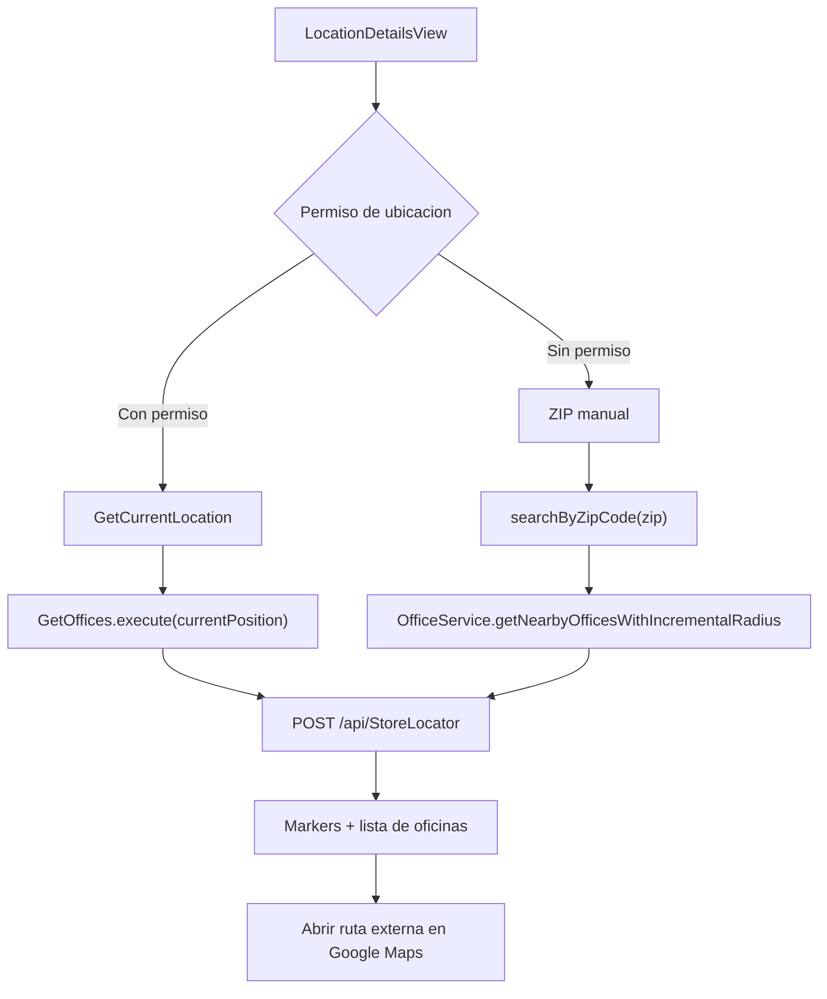
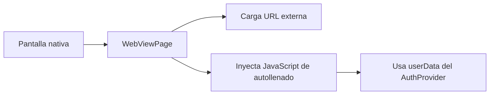

# Flujo de la Aplicacion

## Flujo principal de navegacion

## Flujo de autenticacion y estado

## Flujo de Add Insurance

## Flujo de localizacion

## Flujo de WebView

## Notas de flujo

- La app arranca en `AuthSplashScreen`, no en `SplashScreen`.
- `SplashScreen` existe como utilidad generica, pero no esta registrada en las rutas principales.
- El flujo de `HomePage` depende fuertemente de `AuthProvider.currentUser`.
- El flujo de `LocationDetailsView` tiene doble entrada: geolocalizacion o ZIP manual.
- El flujo de productos esta hibrido: arranca en Flutter, pero el cierre del journey ocurre en formularios web.

