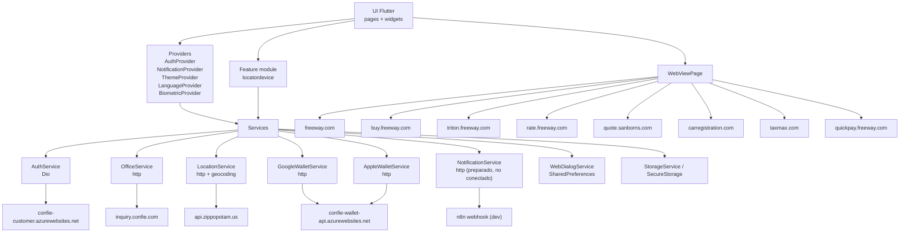

# Arquitectura General

## Resumen

La aplicacion sigue una arquitectura Flutter relativamente simple, centrada en `pages`, `widgets`, `providers` y `services`.

- La navegacion principal se define en `lib/main.dart`.
- El estado global de sesion y configuracion vive en `Provider`.
- El acceso a backend esta concentrado sobre todo en `AuthService`, `OfficeService`, los servicios de Wallet y `LocationService`.
- Varias pantallas no llaman un backend propio, sino que abren formularios web dentro de `WebViewPage`.

## Diagrama de arquitectura

## Capas principales

### 1. Presentacion

- `lib/pages/`: pantallas completas como `LoginPage`, `HomePage`, `ProfilePage`, `IdCardPage`.
- `lib/widgets/`: componentes de UI y subflujos reutilizables.
- `lib/locatordevice/presentation/`: modulo de localizacion con mapa, lista de oficinas y controlador propio.

### 2. Estado

- `AuthProvider`: sesion, usuario actual, token, login, logout, signup, restauracion de sesion, actualizacion local del perfil.
- `NotificationProvider`: hoy no consume backend real; deja lista vacia.
- `BiometricProvider`: integra biometria y usa credenciales guardadas por `AuthProvider`.
- `ThemeProvider` y `LanguageProvider`: configuracion local de tema e idioma.
- `HomePolicyProvider`: ya no consulta backend; reutiliza las polizas recibidas en login.

### 3. Servicios y acceso a datos

- `AuthService`: login, register, change password, update user, forgot password, reset password.
- `OfficeService`: busca oficinas por coordenadas o ZIP.
- `LocationService`: valida ZIP contra Zippopotam y usa geocoding nativo para reverse geocoding.
- `GoogleWalletService` y `AppleWalletService`: generan pases para wallet.
- `WebDialogService`: controla si el modal previo a visitar una web ya fue mostrado.
- `StorageService`: cookies y datos de sesion persistidos localmente.

### 4. Integraciones de salida

- Backend de clientes: autenticacion, registro, actualizacion de usuario.
- Backend de oficinas: store locator.
- Backend de wallet: generacion de pases.
- Servicio externo de ZIP: validacion y enrichment de ciudad/estado.
- Web embeds: cotizadores, quick pay, legal pages y productos complementarios.

## Endpoints base identificados

| Categoria | Base / host | Uso principal |
| --- | --- | --- |
| Auth / customer | `https://confie-customer.azurewebsites.net` | login, registro, cambio de password, update user, forgot/reset password |
| Wallet | `https://confie-wallet-api.azurewebsites.net` | generacion de pases Apple/Google Wallet |
| Office locator | `https://inquiry.confie.com` | busqueda de oficinas |
| ZIP lookup | `https://api.zippopotam.us/us/` | validacion de ZIP y obtencion de ciudad/estado |
| Notification webhook | `https://u-n8n.virtalus.cbluna-dev.com/webhook/confie_notifications` | servicio preparado, hoy no usado por el provider |
| Web embeds | `freeway.com`, `buy.freeway.com`, `triton.freeway.com`, `rate.freeway.com`, `quote.sanborns.com`, `carregistration.com`, `taxmax.com`, `quickpay.freeway.com` | formularios y paginas web abiertas dentro de la app |

## Endpoints backend directos

### AuthService

Base: `envLogin`

- `POST /api/Mobile/Login`
- `POST /api/Mobile/Register`
- `POST /api/Mobile/ChangePassword`
- `POST /api/Mobile/User`
- `POST /api/Mobile/SendForgotPasswordMessage`
- `POST /api/Mobile/ResetPassword`

### OfficeService

Base: `envOffice`

- `POST /api/StoreLocator`

### Wallet

Base: `envWallet`

- `POST /DownloadGooglePassTask`
- `POST //DownloadApplePassTask`

Nota: Apple Wallet tiene doble slash en la constante actual (`//DownloadApplePassTask`). El request probablemente siga resolviendo, pero conviene corregirlo para evitar inconsistencias.

## Observaciones arquitectonicas clave

1. `HomePage` no consulta una API de polizas. Las polizas llegan dentro de la respuesta de login y se conservan en `AuthProvider`.
2. `NotificationProvider` no usa hoy `NotificationService`; la UI queda preparada pero sin consumo real.
3. Buena parte del modulo "Add Insurance" no consume backend nativo de la app; valida ZIP y luego abre formularios web embebidos.
4. `WebViewPage` no solo renderiza sitios: tambien inyecta JavaScript para prellenar formularios usando datos del usuario.
5. El modulo `locatordevice` es el bloque con arquitectura mas cercana a clean architecture: presentation, domain, data y DI.

